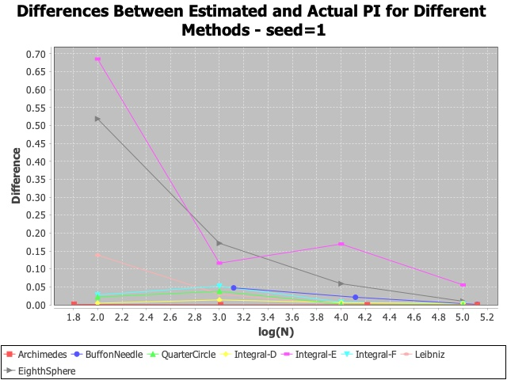
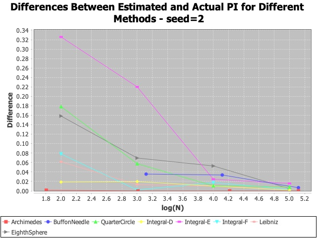
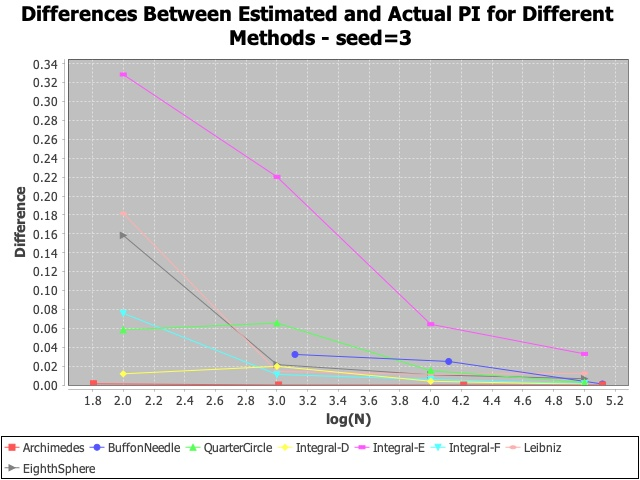
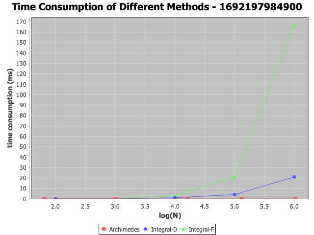
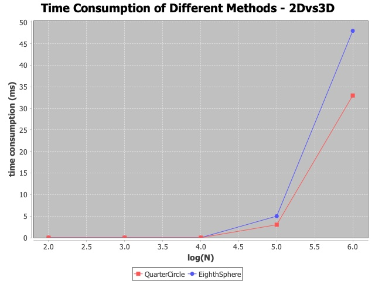
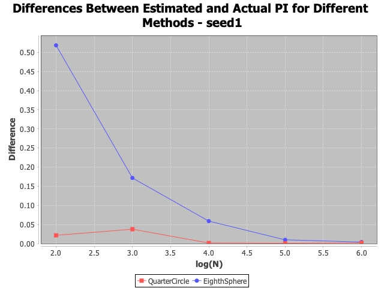
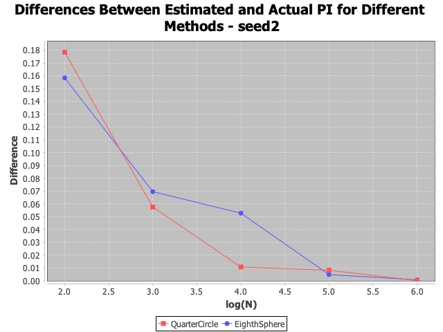
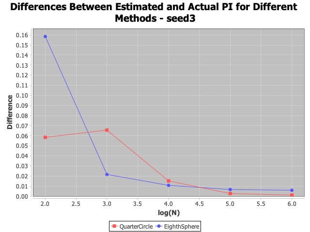

The codes are for the school project. Eight different methods are used to estimate the value of PI. Also, sigma errors, accuracies and time consumptions are compared among these methods.  *N* represents the level of number of sides for Non-Monte Carlo method and number of random samples for Monte Carlo methods here. 

# 1. Instruction of Directories

The estimation methods are written in Java classes. The directory 'plot' contains the plots of value estimation, accuracy and time consumption. The instruction of directories under src is as follows:

## calc:

- CalcPI: This class defines member variables **n_list** (stores the Ns), **pi_list** (stores the results of estimated PI according to N) and member methods **calc_pi_list** (stores the results of estimation into pi_list), **timer** (calculates the time consumption in ms of estimating PI once according to N), **time_plot** (plots the time consumption versus log-N for one method), **diff_plot** (plots the absolute difference between estimated and actual PI versus log-N for one method). 
- NonMonteCarlo: This is the subclass of CalcPI, defining member method **value_plot** (plots the estimated PI versus log-N for one Non-Monte Carlo method). 
- MonteCarlo: This is the subclass of CalcPI, defining member variables **rand** (random seed), **sigma_list** (stores sigma error for different N) and member methods **setSeed** (sets or changes random seed), **calc_sigma_list** (stores sigma errors into sigma_list), **value_plot** (plots the estimated PI with 1 and 2 sigma error bars versus log-N for one Monte Carlo method). 
- Integral: This is the subclass of MonteCarlo. Some Monte Carlo methods estimate PI using integral, and these methods have similar steps on calculating PI. Therefore, an additional class is added here for the integral estimation methods. 

## method:

The classes in this directory define detailed methods on calculating PI and sigma error. 

- Archimedes: This is the subclass of NonMonteCarlo. The method is to calculate the circumference of an N-polygon, use the circumference as the approximation of a circle's circumference and divide it by 2 times of the radius to achieve PI. 
- BuffonNeedle: This is the subclass of MonteCarlo. The method is to drop the needle with length *l* randomly onto a plane area with parallel lines in distance *a*. The probability that the needle interacts with lines p=2l/(PI*a). 
- QuarterCircle: This is the subclass of MonteCarlo. Generate a point with coordinate (x, y) where both x and y are random numbers between 0 and 1. When $x^2$ + $y^2$ <= 1, the point lies in the quarter of circle. The probability that a point lies in the quarter circle p=PI/4.
- IntegralD: This is the subclass of Integral. Sum *f(x)* = $\sqrt {1-x^2}$ from *x=0* to *x=1*, and achieve PI/4. 
- IntegralE: This is the subclass of Integral. Sum *f(x)* = $\frac {e^{-x}}{\sqrt x}$ from *x=0* to *x=infinite*, change *u = 1/(x+1)* so the integral over u is from 0 to 1. The result of integral equals Gamma(1/2) ($\sqrt {PI}$).
- IntegralF: This is the subclass of Integral. Sum *f(x)* = $\frac {1}{e^x - 1}$ from *x=0* to *x=infinite*, change *u = 1/(x+1)*. The result of integral equals $\frac {{PI}^2}{6}$. 
- Leibniz: (Madhava-Gregory-Leibniz series) This is the subclass of MonteCarlo. Generate x, y such that both x and y are random numbers between 0 and 1. The probability that the closest integer to x/y is even = (5 − PI)/4. 
- EighthSphere: This is the subclass of MonteCarlo. Generate a point in 3D with coordinate (x, y, z) where x, y and z are all random numbers between 0 and 1. When $x^2$ + $y^2$ + $z^2$ <= 1, the point lies in the Eighth of a ball. The probability that a point lies in the eighth of sphere p=PI/6.

## other

Some minor methods are under this directory. 

- ComparisonPlot: This class provides methods of plotting for the comparison of multiple estimation methods, including **compare_diff** (plots the differences between estimated and actual PI for multiple methods), **compare_time** (plots time consumptions for multiple methods). 

## test

The java files under this directory are for testing purpose. 

## execution

The main estimating and comparing codes are under this directory. 

- EstimatingPI: Estimate PI and error bars (for Monte Carlo methods) using eight methods, and plot the estimating results. 
- ComparingDiff: Compare the difference between estimated and actual PI for eight methods, and plot for the differences. 
- ComparingTime: Choose the best three methods from the two previous steps, plot for the time consumptions. 
- ComparingDimension: Compare the accuracies and time consumptions between the methods of 2D circle and 3D sphere (comparison between QuarterCircle and EighthSphere).

# 2. Main Results

## 2.0 Execution Environment

The codes are run under the following environment: 

- OS: macOS 11.6.6
- Java: 18.0.1
- External Libraries: The following jar packages are used for plotting: jcommon-1.0.14, jfreechart-1.0.19

## 2.1 Sigma Error

In general, these methods perform well on variances. The sigma errors decline as Ns grow in most situations. However, for IntegralD (estimating Gamma(1/2) using integral), the sigma errors are too large that the error bars do not appear on the plot. The estimated value of PI from this method is unstable. The plots below shows the unstable estimation values of method IntegralD. Also, the sigma errors here are so large that the error bars are out of scope. 

.jpeg)

## 2.2 Accuracy

The three methods which has the closest estimation value to the actual PI are: Archimedes, Integral-D and Integral-F. By contrast, the accuracy of Integral-E is wanting. 

## 2.3 Time Consumption

The method Archimede has the best efficiency. It should be pointed out that the time complexity of the Archimedes algorithm used here is O(log(N)). Integral-D and Integral-F also have good efficiency when N<10e04. However, the consumptions for the two methods grow significantly as N get larger than 10e04. 

## 2.4 Simulation of 2D Circle versus 3D Sphere

Not surprisingly, the method of Monte Carlo simulation in a 3D ball is higher than that in a 2D circle. On the other hand, the accuracies of the 2 simulation methods tend to be close as N grows. Detailed differences of accuracies among different dimensions in Java can be further discussed. 

# Author

The work is done by Ning Zhang (21212088). 